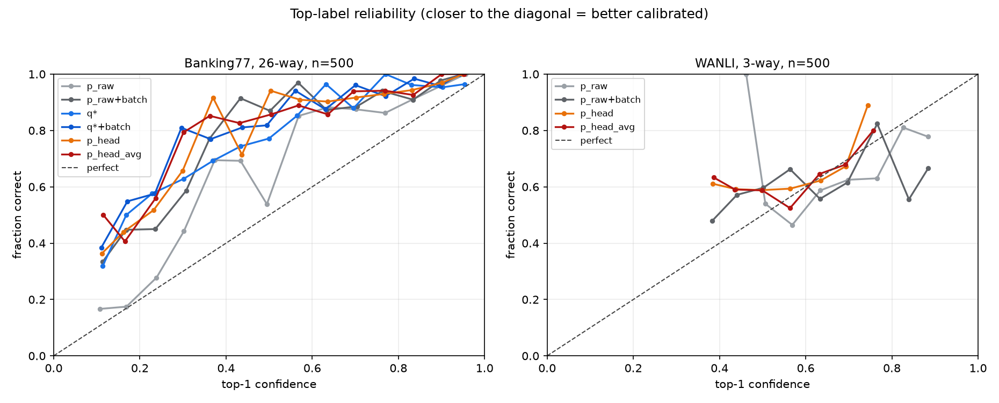
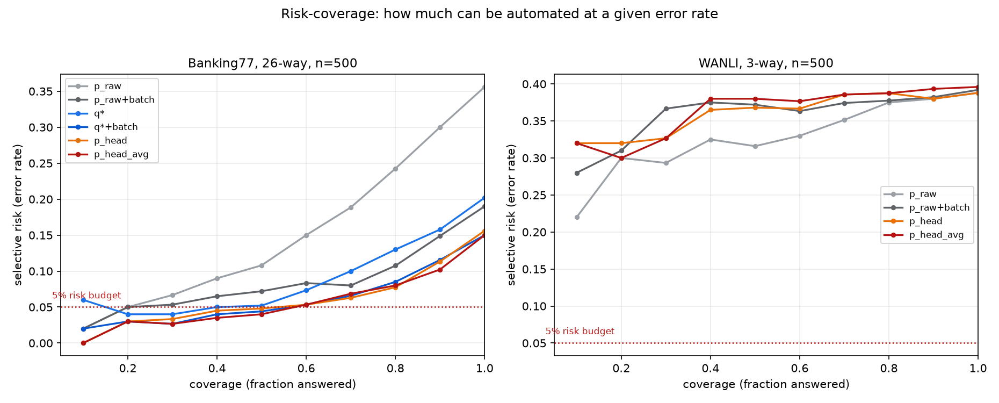
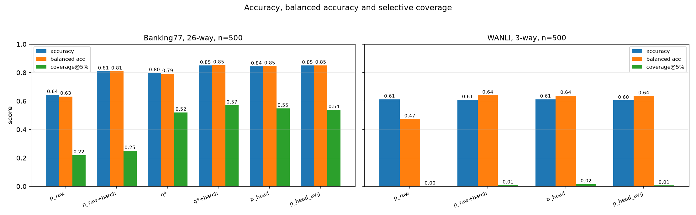

<div align="center">

```
▄████▄ ▄▄  ▄▄ ▄▄ ▄▄ ██     ██▄  ▄██ ████▄    ██ ▄▄▄▄▄ ▄▄ ▄▄
██▄▄██ ███▄██ ▀███▀ ██     ██ ▀▀ ██  ▄██▀    ██ ██▄▄  ██▄██
██  ██ ██ ▀██   █   ██████ ██    ██ ███▄▄ ████▀ ██▄▄▄  ▀█▀
```

**Turn any small LM into a Jev-style decision model.**
Typed decisions, one forward pass, calibrated confidence, order-invariant readout.

English · [简体中文](README.zh-CN.md)

</div>

---

## What this is

Reproducing the *Jev* decision interface (TypeSafe AI, "System One" model) on a
small open LM, and testing one specific hypothesis:

> **Can self-consistency distillation turn any LM into a Jev-style decision model,
> and does the distilled readout beat raw option-logit readout?**

Jev is closed-weight but documents its interface: it never generates text.  It
takes a `state` plus typed `questions` and returns *choices*, *scores* or *nouls*
(yes/no probabilities) with calibrated confidence.  This repo builds the
**"read the frozen LM, then distil the readout into a head"** family and measures
it against its own free baseline, with paired significance tests, calibration
metrics and selective-prediction curves.

## Headline

1. **The label prior, not the option order, was the dominant error.**  A label-free
   **batch prior** correction is worth **+0.166 accuracy** on 26-way Banking77 on its
   own, before any training (`p_raw` 0.644 -> 0.810).
2. **The correction has to go into the distillation target.**  Applied post-hoc to
   an already-trained head it *collapses* it (0.762 -> 0.268), because the head has
   already absorbed the bias in `q*`.
3. **A single forward pass then reaches the multi-pass ceiling**: 0.844 accuracy /
   0.846 balanced accuracy, coverage@5% 0.600 and order agreement 0.955, against
   0.644 / 0.632 for the free baseline (+0.200, 95% CI `[+0.158, +0.244]`,
   McNemar `p = 3.3e-19`).
4. **What the head buys beyond accuracy is selective prediction**: coverage at a 5%
   error budget rises 0.220 -> 0.600, which is the number that decides whether a
   pipeline can be automated at all.

## The experiment

Options are rendered **in one shared context**.  Two readouts come out of the same
forward pass:

| readout | what it is |
|---|---|
| `p_raw` | softmax of the frozen LM's label-token logits at the answer position — the free baseline |
| `p_head` | a small MLP over the hidden state at the **end of each option's text** |

Targets come from **self-consistency aggregation** over paraphrase x option-order
views, followed by a **label-free debiasing** step (position bias and label prior).
Three things are compared on held-out data:

1. `p_raw` — 1 forward pass, no training
2. `q*` — V forward passes, no training (the ceiling a single pass tries to compress)
3. `p_head` — 1 forward pass, trained

Distillation is **forward KL to the soft, debiased `q*`** — never hard labels, which
would discard exactly the confidence signal this is about.

> **Read the hidden state at the end of the option text, never at the option's
> label letter.**  A causal LM at the label position has not read the option yet,
> so a head reading there scores text it cannot see and silently does nothing.
> That was the first real bug here; the LoRA trainer had a second, related
> target-ordering bug.  Both are in [`docs/RESULTS.md`](docs/RESULTS.md).

## Results

Base model `Qwen/Qwen3.5-2B-Base`.  Full tables, paired CIs and commands:
[`docs/RESULTS.md`](docs/RESULTS.md), [`docs/REPRODUCE.md`](docs/REPRODUCE.md).

### 26-way intent (Banking77, 6 views, n=500)

| method | acc | bal_acc | cov@5% | order argmax agreement |
|---|---|---|---|---|
| `p_raw` | 0.644 | 0.632 | 0.220 | 0.556 |
| `p_raw` + batch prior (still 1 pass) | 0.810 | 0.810 | 0.250 | – |
| `q*` | 0.772 | 0.765 | 0.420 | – |
| `q*` + batch prior + logmean | 0.850 | 0.852 | 0.570 | – |
| `p_head` | 0.762 | 0.751 | 0.440 | 0.928 |
| `p_head`, debiased target | **0.844** | **0.846** | **0.600** | **0.955** |
| `p_head_avg`, debiased target | **0.852** | **0.853** | 0.582 | – |
| `p_lora_head` (LoRA + head) | 0.780 | 0.769 | – | 0.966 |

### 3-way NLI (WANLI, 12 views, n=500)

Accuracy gains are within noise; the wins are balanced accuracy and order
invariance.

| method | acc | bal_acc | order argmax agreement |
|---|---|---|---|
| `p_raw` | 0.612 | 0.473 | 0.449 |
| `p_raw` + batch prior | 0.608 | **0.640** | – |
| `q*` + logmean | **0.634** | 0.579 | – |
| `p_head` | 0.624 | 0.560 | 0.898 |
| `p_head`, debiased target | 0.612 | 0.639 | **0.912** |

### 77-way intent (Banking77 full, noul format)

Option-conditioned yes/no has no label ceiling and is order-invariant by
construction.  Here the **model** matters: a base model ranks but produces
near-uniform probabilities, an instruct model (smaller!) produces usable ones.

| base model | `p_raw` | `q*` | `p_head` | `p_head` ECE (cal) | nll |
|---|---|---|---|---|---|
| Qwen3.5-2B-Base | 0.376 | 0.422 | 0.472 | 0.131 | 3.81 |
| Qwen2.5-1.5B-Instruct | 0.472 | 0.504 | **0.556** | **0.044** | 2.13 |

### All-K cyclic shifts are not worth it

Showing the options in all K cyclic shifts makes an additive slot bias cancel
exactly under a geometric mean, but at K=26 it costs 9x the compute for a slightly
*worse* result (both sides using a same-split batch prior):

| Banking77 test (n=500) | acc | cov@5% |
|---|---|---|
| 6 views (3 random permutations x 2 paraphrases) | **0.842** | **0.576** |
| 52 views (all 26 cyclic shifts x 2 paraphrases) | 0.830 | 0.490 |

A cyclic shift preserves adjacency, so a bias that depends on relative order is not
averaged out, while a random permutation breaks that structure.  Details in
[`docs/RESULTS.md`](docs/RESULTS.md).

## Figures

Top-label reliability (closer to the diagonal is better), risk-coverage for
selective prediction, and the headline metrics side by side:







Regenerate with `./run.sh figures` (scikit-learn `CalibrationDisplay`, top-label
reduction for K > 2).

## Quick start

Runs on a single GPU; ~24 GB is plenty.  No scheduler required.

```bash
git clone https://github.com/our0boros/AnyLM2Jev.git && cd AnyLM2Jev

python -m venv .venv && . .venv/bin/activate     # or: conda env create -f environment.yml
pip install -r requirements.txt

./run.sh data          # fetch WANLI + Banking77 into data/   (CPU, needs network)
./run.sh banking77     # 26-way intent, debiased head  -> runs/eval/banking77_qwen35.json
./run.sh wanli         # 3-way NLI
./run.sh banking77_full  # 77-way option-conditioned (noul)
./run.sh figures       # -> docs/figures/
```

Everything is a plain CLI flag, so a single stage can be run by hand:

```bash
PYTHONPATH=src python scripts/10_induce.py \
  --model Qwen/Qwen3.5-2B-Base --data data/banking77_train.jsonl \
  --out runs/induce/banking77_train --paraphrases 2 --max-orders 3 --max-length 768

PYTHONPATH=src python scripts/20_train_head.py \
  --induce runs/induce/banking77_train --out runs/head/banking77_db.pt \
  --views all --epochs 40 --debias batch --combine logmean

PYTHONPATH=src python scripts/30_eval.py \
  --induce runs/induce/banking77_train --head runs/head/banking77_db.pt \
  --test-induce runs/induce/banking77_test --out runs/eval/banking77_qwen35.json
```

Overrides for `run.sh`: `MODEL`, `DEVICE` (`cpu` works for the analysis stages),
`PYTHON`, `EPOCHS`, `BATCH_SIZE`.

`Qwen/Qwen3.5-2B-Base` is a `qwen3_5` hybrid checkpoint and needs
`transformers>=5.17`.

Tests are pure numpy and need no GPU:

```bash
python -m unittest discover -s tests
```

## Layout

```
run.sh              single-GPU driver: data | wanli | banking77 | banking77_full | figures
src/jev/            reusable package
  schema.py         DecisionItem: state + question + options + gold
  prompts.py        paraphrase x option-order views; choice and noul templates
  modeling.py       frozen LM load, label readout, differentiable readout
  induce.py         choice-format targets: p_raw, q*, per-view hidden states
  noul.py           option-conditioned yes/no targets (arbitrary cardinality)
  debias.py         label-free position marginalization + batch / content-free priors
  head.py           per-option score head
  distill.py        forward-KL training objective
  calibrate.py      temperature scaling + ECE
  metrics.py        accuracy / balanced accuracy / ECE / Brier / NLL / coverage@risk
  data.py           WANLI and synthetic decision sets
scripts/            stage entrypoints (data, induce, cf-prior, train, eval, analyze, figures)
tests/              deterministic numpy tests
docs/               RESULTS, REPRODUCE, figures/
data/ runs/         generated artefacts (ignored)
```

## Related work and references

Jev is closed-weight and this repo only reproduces its public *decision interface*.
The label-free corrections used here come from the calibration literature, and the
open reproductions of the Jev interface are what established `p_raw` (a single
forward pass over the option-label logits) as the baseline worth beating:

- Zhou et al., *Batch calibration: Rethinking calibration for in-context learning
  and prompt engineering*, ICLR 2024.
- Zhao et al., *Calibrate before use: Improving few-shot performance of language
  models*, ICML 2021.
- Zheng et al., *On prompt-driven safeguarding for large language models*, ICLR 2024.
- TypeSafe AI, [Jev](https://typesafe.ai) — the interface this repo reproduces.
- Open reproductions of that interface, including
  [SemIf / OpenJev](https://github.com/TheoLeeCJ/SemIf) and
  [AnyJev](https://github.com/nokia-applied-research/AnyJev).

Thanks to the authors of the above for the method and the baselines.

## What this does and does not claim

* **Does**: on a frozen 2B backbone, a label-free prior correction plus
  self-consistency distillation into a per-option head gives a large, significant
  gain over the free logit readout, near-perfect order invariance, and much better
  selective prediction than either the free baseline or the label-free aggregate.
* **Does not**: that a head on frozen features can exceed what those features
  encode.  The LoRA result shows the frozen head is capped, which is why that flag
  exists.
* **Open**: the noul phrasing for binary questions, a reference against a
  production decision API (no access), and learned rather than fixed
  selective-prediction thresholds.

## License

MIT — see [`LICENSE`](LICENSE).
